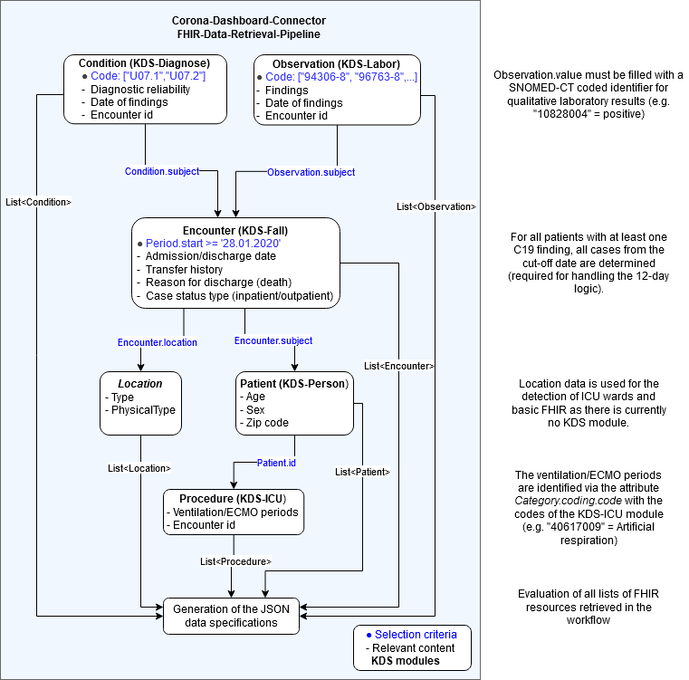

# MII-FHIR-to-Corona-Dashboard-Json-Processor

The _DashboardDataProcessor_ provides a middleware solution aimed to allow provisioning aggregated,
anonymous datasets for feeding the [NUM CODEX Dashboard](http://coronadashboard.ukbonn.de) developed
in the context of
the [NUM CODEX project](https://www.netzwerk-universitaetsmedizin.de/projekte/codex) from an
interoperable,
fully [MII national core dataset](https://simplifier.net/organization/koordinationsstellemii/~projects)
based [FHIR](https://hl7.org/FHIR/) representation of operational patient data from hospital
information systems as specified within
the [Medical Informatics Initiative (MII)](https://www.medizininformatik-initiative.de/en/start).
The _DashboardDataProcessor_ is currently developed further and maintained in the NUM RDP project.
The FHIR data can be provided via any standard compliant FHIR server that supports the required (simple) 
features of FHIR search. This should enable new sites to contribute to the dashboard with
minimal additive effort if interoperable FHIR representations of operational data are already
available. The development was supported by the German Federal Ministry of Science (Bundesministerium für Bildung und Forschung, BMBF)
in the context of
the [NUM RDP](https://www.netzwerk-universitaetsmedizin.de/projekte/aktuelle-projekte) (FKZ
01KX2121), NUM CODEX (FKZ 01KX2121) and MII ADMIRE and SMITH (FKZ 01ZZ1602C, FKZ 01ZZ1803Q)
projects.

For information regarding active participation in the dashboard endeavour, please contact us at
diz@ukbonn.de. For bug reports, improvement suggestions, and related technical conversations, please
use the usual GitHub mechanisms.

MII core dataset models are maintained
on [ArtDecor](https://art-decor.org/art-decor/decor-project--mide-). The current MII core dataset
specifications are available
on [Simplifier](https://simplifier.net/organization/koordinationsstellemii/~projects).

## Structure Overview

The following table gives an overview over the documents used, as well as their corresponding links
and a short description.

<table style="width:100%" border="1" >
<tr>
<th>Document name and link</th>
<th>Description</th>
</tr>
<tr>
<td><a href="./files/Datensatzbeschreibung_COVID_dashboard_v0_3_0_final.pdf" target="_blank">JSON dataset description</a></td>
<td>The dataset description of the resulting JSON format, including the description of the aggregated data items.</td>
</tr> 
<tr>
<td><a href="./files/Dokumentation_Dashboard_Backend_v0_3_0a.pdf" target="_blank">Documentation of the FHIR implementation</a></td>
<td>A documentation of which data items are filled with which FHIR resources and attributes according to which logic.</td>
</tr>
<tr>
<td><a href="./readme.md">Installation/Configuration guide</a></td>
<td>The installation and configuration instructions for this project</td>
</tr>
<tr>
<td><a href="./doc/index.html" target="_blank">Javadoc Files</a></td>
<td>The Javadoc files for this project</td>
</tr>
<tr>
<td><a href="./samples" target="_blank">Sample data</a></td>
<td>Example bundles to illustrate the expected resource structure and for test imports.</td>
</tr>
</table>

## License

This project is released under the terms of the [GPL version 3](LICENSE.md).

```
This program is free software: you can redistribute it and/or modify
it under the terms of the GNU General Public License as published by
the Free Software Foundation, either version 3 of the License, or
any later version.

This program is distributed in the hope that it will be useful,
but WITHOUT ANY WARRANTY; without even the implied warranty of
MERCHANTABILITY or FITNESS FOR A PARTICULAR PURPOSE.  See the
GNU General Public License for more details.

You should have received a copy of the GNU General Public License
along with this program.  If not, see <http://www.gnu.org/licenses/>.
```

## Requirements

The code is platform independent and was tested on Linux and Windows environments.

The following software must be available to execute the program:

- Java 17 (JDK mandatory for compilation, OpenJDK recommended)
- Apache Maven (mandatory for compilation, optional if provided jar is executed)
- Dependencies ([utilities](https://www.github.com/mwtek/utilities)
  and [dashboardlogic](https://www.github.com/mwtek/dashboardlogic) repositories)

It is recommended to have both programs installed in a way that the correct versions of *java* and *
mvn* are found in the system path.

In addition, at least 4 GB of free RAM, preferably 8 GB, should be available. The size depends on
the number of resources that have to be retrieved from the FHIR server. In a test with ~ 500,000
resources, 4 GB was the lower limit.

## Requirements FHIR data

In order for the data set to be generated completely and correctly, the following FHIR resource
types are required:

- Observation (Covid-19 laboratory codes, encoded in LOINC; results coded as <i>CodeableConcept</i>
  with codes from
  this <a href="https://simplifier.net/medizininformatikinitiative-modullabor/valuesetqualitativelaborergebnisse">
  MII value set</a>)
- Condition (Covid-19 diagnosis code, encoded in ICD-10)
- Patient (Age/zip code/gender required)
- Encounter (Required, among other things, for admission and discharge times/types, as well as ICU
  stays)
- Location (for the detection of ICU wards)
- Procedure (for the detection
  of <a href="https://simplifier.net/medizininformatikinitiative-modul-intensivmedizin/valueset-code-procedure-beatmung-snomed">
  artificial respiration</a>
  and <a href="https://simplifier.net/medizininformatikinitiative-modul-intensivmedizin/valueset-code-extrakorporale-verfahren">
  ECMO procedures</a>)

The following diagram shows the workflow of the FHIR data query and the content of the respective
FHIR resources required for the Json transformation:



## FHIR search queries

The following is an overview of the approximate FHIR search requests sent from the processor to the
FHIR server:

| Resource    | FHIR Search Query                                                                | Comments                                         |
|-------------|----------------------------------------------------------------------------------|--------------------------------------------------|
| Condition   | [base]/Condition?code=U07.1,U07.2&_pretty=false&_count=500                       |                                                  |
| Observation | [base]/Observation?code=94640-0,94306-8,96763-8,96895-8&_pretty=false&_count=500 |                                                  |
| Patient     | [base]/Patient?_id=1234,1235,1236                                                | IDs from Observation.subject + Condition.subject |
| Encounter   | [base]/Encounter?subject=1234,1235,1236                                          | IDs from Patient.subject                         |
| Procedure   | [base]/Procedure?code=233573008,243147009&subject=1234,1235,1236                 | IDs from Encounter.id                            |
| Location    | [base]/Location?_id=123,234,345                                                  | IDs from Encounter.location                      |

## Compatibility KDS profile versions

The KDS profiles are highly dynamic and the current status quo of the profiles can differ
significantly from the development status of the Dashboard Processor. To cover future changes, we
have always worked with the current working versions in the Simplifier. The risk that profile
changes will also affect the workflow in the Dashboard Processor is small, but not impossible. The
following table provides an overview of which KDS profile versions were current at the time of
release and for which compatibility has been adequately tested. In case of problems and obvious
incompatibilities please email the developer or open an issue. It is tried to respond to the
constant innovations by new Dashboard Processor versions.

| KDS Module                                                                                        | Profile(s)                                                                                                 | Version       | Comments |
|---------------------------------------------------------------------------------------------------|------------------------------------------------------------------------------------------------------------|---------------|----------|
| [KDS Person](https://simplifier.net/medizininformatikinitiative-modulperson)                      | [Patient](https://simplifier.net/medizininformatikinitiative-modulperson/sdmiipersonpatient)               | 2.0.0-ballot2 |          |
| [KDS Fall](https://simplifier.net/medizininformatikinitiative-modulfall)                          | [Encounter](https://simplifier.net/medizininformatikinitiative-modulfall/kontaktgesundheitseinrichtung)    | 1.0.1         |          |
| [KDS Labor](https://simplifier.net/medizininformatikinitiative-modullabor)                        | [Observation](https://simplifier.net/medizininformatikinitiative-modullabor/observationlab)                | 1.0.6         |          |
| [KDS Diagnose](https://simplifier.net/medizininformatikinitiative-moduldiagnosen)                 | [Condition](https://simplifier.net/medizininformatikinitiative-moduldiagnosen/diagnose)                    | 2.0.0-alpha3  |          |
| [KDS ICU](https://simplifier.net/MedizininformatikInitiative-Modul-Intensivmedizin/~introduction) | [MII_Beatmung](https://simplifier.net/medizininformatikinitiative-modul-intensivmedizin/miibeatmung)       | 1.0           |          |
| [KDS Strukturdaten](https://simplifier.net/medizininformatikinitiative-modulstrukturdaten)        | [Location](https://simplifier.net/medizininformatikinitiative-modulstrukturdaten/sd_mii_struktur_location) | 1.0           |          |

## Runtime Configuration

The runtime configuration can be found in `src/main/resources/application.yaml`, it must be modified
according to the local setup. If the route is taken via the execution of a compiled .jar (see
chapter 'Program execution'), a copy of this file must also be located in the base directory.

The main adjustments that need to be made:

- Adjustment of the local location information in the "provider" area, which are part of the output
- Adaptation of the FHIR server endpoint to the local endpoint including authentication
  configuration

Optional adjustments:

- If a location cannot serve various data items from the specification, these can be explicitly
  excluded here
- If LOINC/ICD/Procedure codes are to be replaced by internal code identifiers, this can be
  configured here (e.g. because the local mapping has not yet been completed)

The runtime configuration provides comments for all setup options.

## Program installation and execution

The program is set up as a Maven project and can either be build manually or by executing the
"build.sh" script. To use this application, the two libraries "utilities" and "dashboardlogic"
have to be cloned.

**Install and run via script**

* Create a new Folder where the three Repos are supposed to be located in.

```
mkdir dashboardprocessor
cd dashboardprocessor
```

* Clone the repos in there via:

```
git clone https://www.github.com/mwtek/utilities.git
git clone https://www.github.com/mwtek/dashboardlogic.git
git clone https://www.github.com/mwtek/dashboarddataprocessor.git
```

* Go into "dashboarddataprocessor"

```
cd dashboarddataprocessor
```

* Execute "build.sh"

```
./build.sh
```

After installation the project can be run via:

```
mvn spring-boot:run
```

**Install and run manually**

For the Project to run without any issues it is mandatory to install the other two libraries in a
certain order:

utilities &#8594; dashboardlogic &#8594; dashboarddataprocessor

First utilities, then dashboardLogic

```
mvn clean install
```

Then execute the main Project:
dashboarddataprocessor

```
mvn clean install
mvn spring-boot:run
```

**Executing a jar file**

**Important:** For this solution, a copy of the `application.yaml` must be created, copied to the
base folder and configured with the local settings. When the .JAR file is executed,
the `application.yaml` is taken from the base directory by default at runtime.

A precompiled file named `dashboarddataprocessor-0.3.0.0.jar` can be found in the project target
directory. Be aware that before you can access the .jar file, you have to successfully build the
project following one of the before mentioned approaches of 'Install and run via script' or 'Install
and run manually'.

Execute this file (or the precompiled file accordingly):

```
java -jar target/dashboarddataprocessor-0.3.0.0.jar
```

Note that the settings must be adjusted in the .yaml file inside the packed .jar archive. This can
be done by changing the file inside the archive or moving a new settings file to this location
inside the archive, it is not necessary to recompile the code for changes to take effect.

## Authentication FHIR Server

A total of three authentication methods are available to authenticate with the local FHIR
server: `BASIC`, `NONE` and `SSL`. As expected, the configuration takes place in `application.yaml`.

## Notes on the x509 authentication for the Rest API

[Here is a very helpful internet page on setting this up in a Spring boot application](https://www.baeldung.com/x-509-authentication-in-spring-security)

What you need to do boils down to this:

Generate a csr for your server or client, then your certificate authority can use this to generate a
signed certificate.

Then you should import your certificate and private key into a `.p12` file and then a .jks keystore
file.

You should also create a truststore.jks file which contains the root certificate (the certificate
authority)

You can then enter the correct information into your `application.yaml`. Check the current
configuration to see how you can set it up properly, but here is an explanation below:

```
x509-auth:
	keystore: #path to keystore.jks file
	keystore-password: #password to unlock the keystore file
	trust-store: #path to truststore.jks file
	trust-store-password: #password to unlock truststore file
```

No other configurations should be necessary in terms of making edits to the code, and you can find
all the bash commands to do the above-mentioned steps in the link above.

# Starting a process

The process of creating a Corona Dashboard JSON specification starts with a GET request to the local
server instance. It's recommended to use a client like Postman for this. A run can take several
minutes.

Note that the following example is based on the default configuration, the protocol (https when ssl
is used), authentication, hostname and port must be changed on a productive system.

Http-Request:

```
URL: http://localhost:9091/createJson
HTTP-Method: GET
Content-Type: application/json
Authentication-Method: BASIC
Username: user
Password: pwd
```

The response to this HTTP request should contain a fully completed dashboard specification with the
data from the local FHIR server. This can then be submitted via `PUT` to the dashboard backend as
usual. An automatic solution is currently being worked on.

# Installing a version upgrade

IMPORTANT: When using a new dashboard data processor version, please always use the
latest `application.yaml` file as template and put your previous local settings there.
It often happens that new entries or changes here have a big impact on the current version.

Please also note that when upgrading, the code of all 3 projects (`dashboardataprocessor`
, `dashboardlogic` and `utilities`) must be downloaded and installed.

# Not yet supported data items

The following data items (and sub items) are not currently generated by the Processor:

- cumulative.immunestatus.*
- timeline.immunestatus.*

# Outlook

In addition to support for all data items included in the dataset specification, it is planned to
provide a FHIR test dataset in a timely manner. On the one hand, a dataset with sample resources
containing all required attributes is to be created. And on the other hand it is planned to deliver
a complete import script for out-of-the-box filling of a FHIR server with a complete test data set.

The number of parameterizable settings can of course be extended as desired (for example, if the
local FHIR resources have special characteristics). If there should be wishes in this regard, please
send mail to one of the developers or alternatively create an issue.

Consideration is being given to taking the `Encounter.serviceType` of the department contact to
detect ICU stays instead of the location information, as this is likely to be served by more sites
kds compliant by default. For the location, the KDS module is currently under construction and no
implementation guide exists yet.

# Troubleshooting / Logging

If there are many problems in data retrieval, it may be useful to extend logging. It is possible to
output all FHIR search queries executed by the DDP in the console or to write them to a logging
file. For this the following code section in the `application.yaml` must look like this:

```
## Logging
logging:
  level:
    #  root: debug
    de.ukbonn.mwtek.dashboard: DEBUG
    # de.ukbonn.mwtek.dashboardlogic: DEBUG
    # de.ukbonn.mwtek.utilities: DEBUG
  file.name: dashboardprocessor.log
  file.max-size: 100MB
```

The `file.*` fields are optional, but allow the debug output in the console output to be written to
a local file, which by default is located in the top-level folder.

In addition, the `global.debug` field in `application.yaml` can be set to `true` to extend the JSON
output with items that reflect which encounter/patient (resource) IDs made up the individual data
items.

**Java VM Heap Size**

If you discover that the Java VM has too little RAM available (OutOfMemoryError: Java heap space),
you can try increasing the maximum heap size. For example, in this way:

```
java -jar -xMx 8G  target/dashboarddataprocessor-0.3.0.0.jar
```

**Connection to the FHIR server failed: 431 Request Header Fields Too Large**

For some (mostly parallel) FHIR search requests, lists with IDs (e.g. case number) are included as
input filters. If the FHIR server cannot handle the length of the list, it regularly reports a 431
message (Request Header Fields Too Large).

Solution: Reduction of the number of IDs given at the same time. This is controlled by
the `batchsize` parameter in `application.yaml`. The default value is 500, with a value of 1000 the
described behavior could be observed in our tests.

**Operation outcome: Request timed out after x ms**

With the HAPI server it could be observed that with certain data load, the creation of partial index
lists in the navigation via offset and count (e.g. the retrieval of all observation resources) can
take longer than one minute. The HAPI server apparently stops processing requests after one minute
by default if it cannot process the request in that time.

Solution: Caching the data before retrieving it can be helpful in the short term (e.g.
via `?_summary=count`) on the corresponding resource. Otherwise, this timeout value would have to be
increased (configuration varies depending on the FHIR server).
